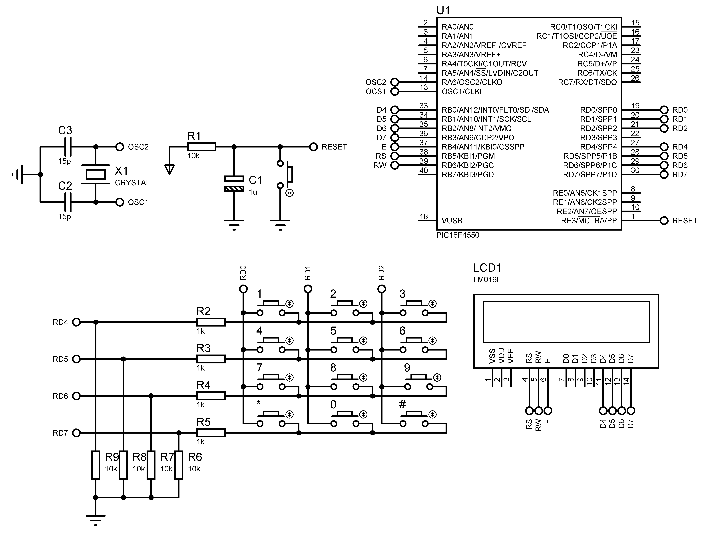
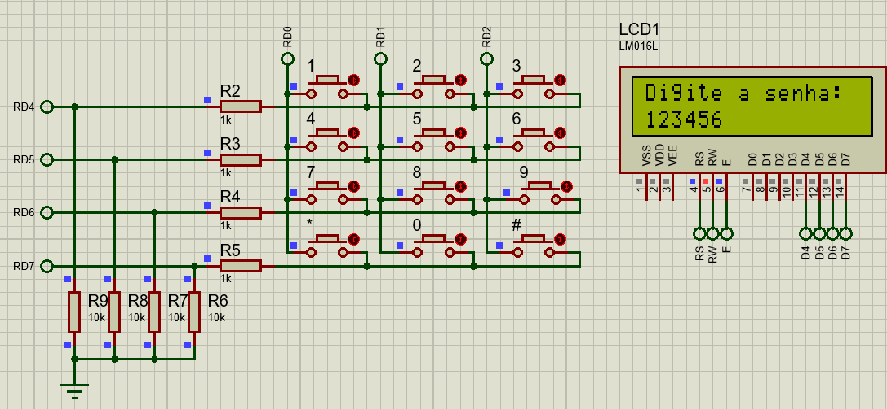
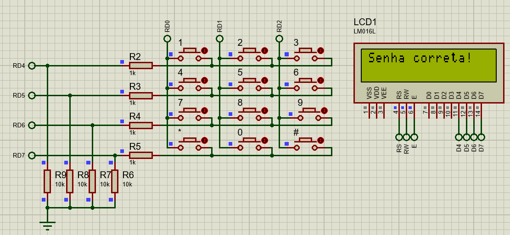
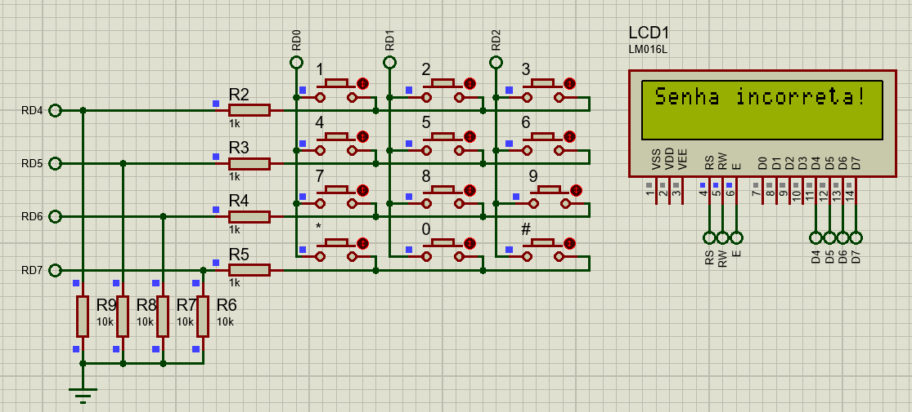
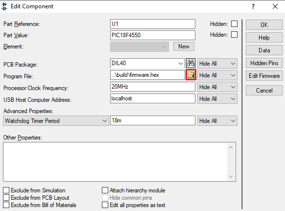
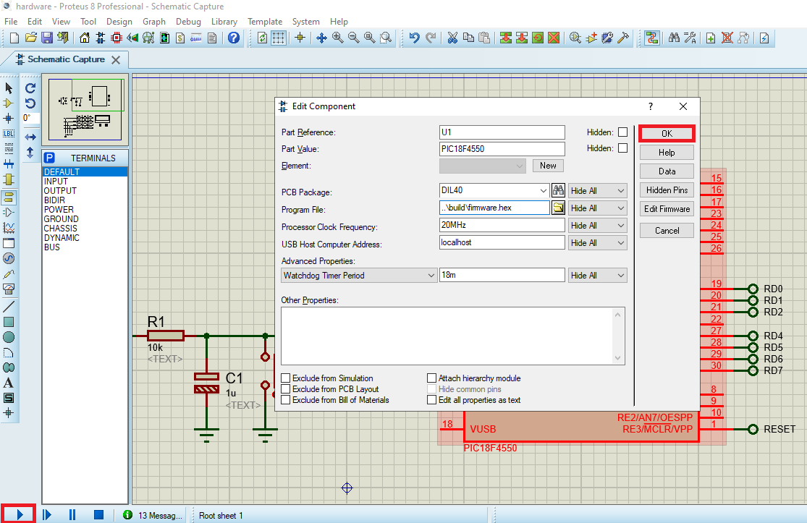

# Eletronic Lock
A firmware that simulates an electronic locking system, which must be activated from a password, where:
- For each key pressed, the algorithm must show on the screen the number identified on the key (0,1,2,3, ... 9);
- The * key serves as "undo", that is, to delete all the numbers already entered, making it possible to enter again with a new set of numbers;
- The # key serves as "Enter", to send the numbers entered for processing.

## Basic operation
- In its normal operation, the phrase "Enter the password:" should appear on the first line of the LCD;
- The user will use the keyboard to enter the password, which may consist of 1 to 10 digits, with the numbers 0 to 9 for each digit, and the numbers entered must appear on the second line of the LCD, and with each number entered the LCD cursor automatically positions the front;
- Do not allow passwords greater than 10 digits;
- The default password when starting the system must be "123456";
- If the user sets the password, a "Senha correta" message should appear;
- If the user misses the password, a "Senha incorreta" message should appear;

## Advanced operation
- If the user tries the password 3 times without success, a "Sistema bloqueado" message;
- The algorithm must provide a master password, which will allow the user to configure a new password. The master password is "3692580147", and cannot be modified;
- When the master password is entered, the LCD will show the message "Nova senha:" on the first line, and on the second line of the LCD the user will enter the new password;

## ☁️ Links

- [Basic Specifications](docs/pdf/basic_specification.pdf)
- [Advanced Specifications](docs/pdf/advanced_specification.pdf)
- [LCD Datasheet (HD44780U)](docs/pdf/HD44780U.pdf)
- [Support Material](docs/pdf/support_material.pdf)

## 💻 Project

#### PICF184550


#### Hardware



#### Inserting Password



#### Correct Password



#### Wrong Password



## 🚀 Technologies

 C ANSI

## 🏃 Usage

Before you compile the code you **have to install the [XC8 Compiler](http://www.microchip.com/mplabxc8windows)**, then just copy and paste one by one the commands bellow:

```
git clone https://github.com/douglasJovenil/eletronic-lock
cd eletronic-lock/src
xc8 main.c -Ofirmware --chip=18f4550 --outdir=../build -I../lib -I../include
```

On software Proteus, open the [simulation file](hardware/hardware.pdsprj), right click on PICF18F4550 and click on **edit properties**


Find the hex firmware, this file will be at [build](build) folder



Select the hex


Click on **OK** and then click on **play** to start the simulation


